# Projet_4A
Projet de 4ème année

## Présentation du projet

L'application Projet_4A permet à un utilisateur de s'inscrire et de se connecter afin de pouvoir accéder à une liste de films. Il peut en cliquant sur un film accéder aux détails de celui-ci comme au résumé, au temps qu'il dure et à la note de satisfaction qu'il a obtenu.

## Utilisation

* Architecture MVVM et Clean Architecture.
* Application codée en language Kotlin.
* Appels Web Service à une Api REST pour alimenter la liste RecyclerView avec Retrofit et Rxjava.
* Utilisation de Gidle pour récupérer les images des films pour le RecyclerView.
* Stockage d'une liste des utilisateurs inscrits sur l'application (mail et mot de passe) dans une base de données en local avec l'outil Room Database.
* RecyclerView pour l'affichage de la liste et CardView pour avoir un meilleur design au niveau de l'affichage de la liste des films.
* Utilisation de la librairie de pagination Paging pour la gestion des paginations de la liste de films.
* Coroutines : gestion de threads asynchrones.

## Design 

Écran Sign Up de l'application:

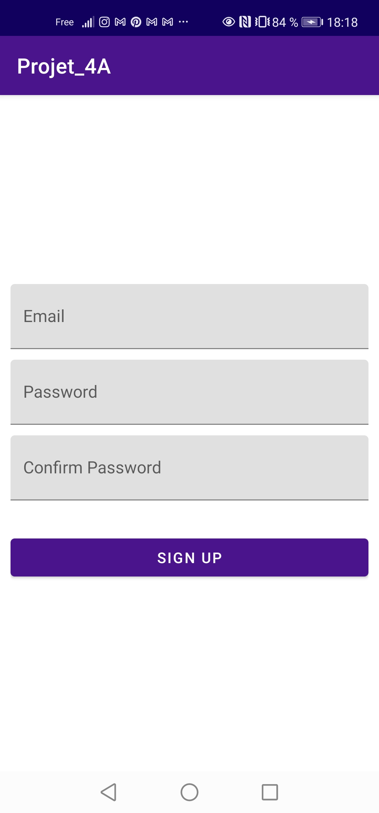
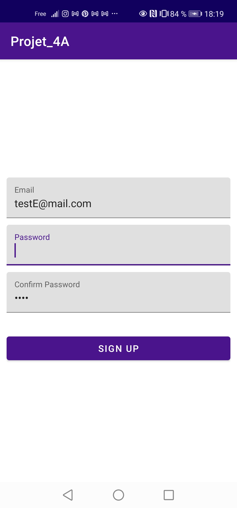
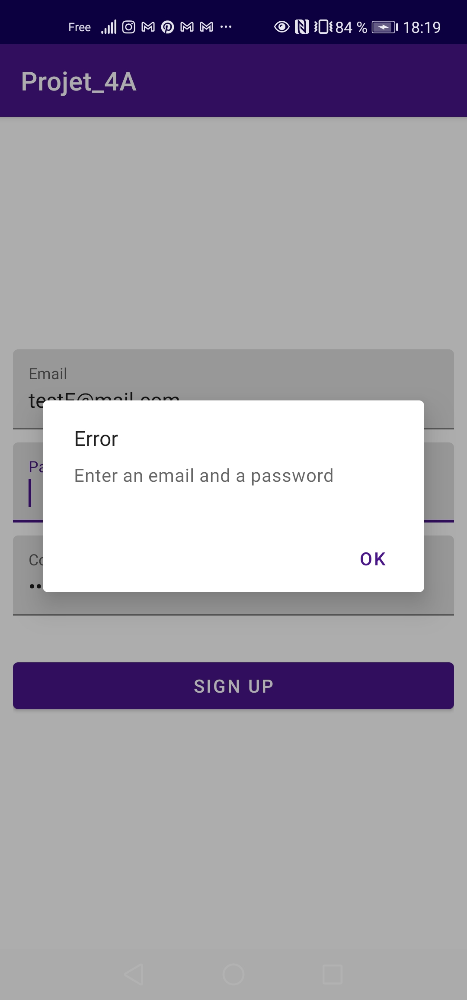
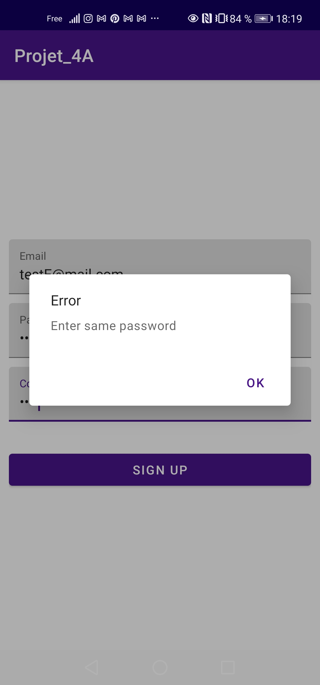
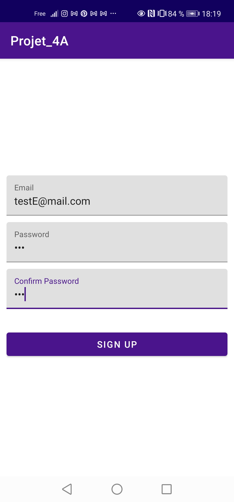
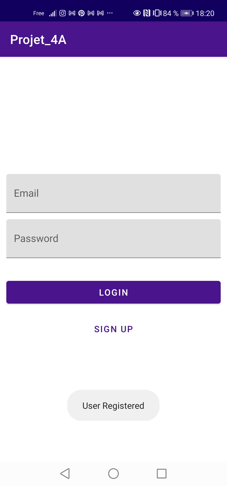

Écran Login de l'application:

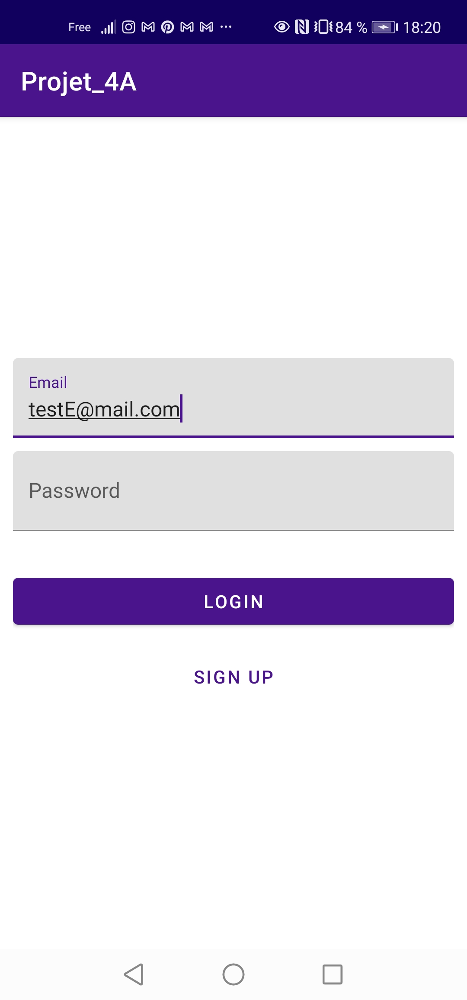
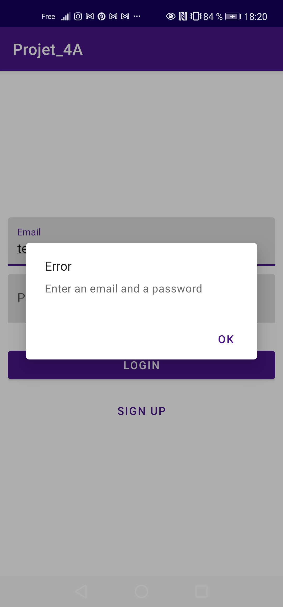
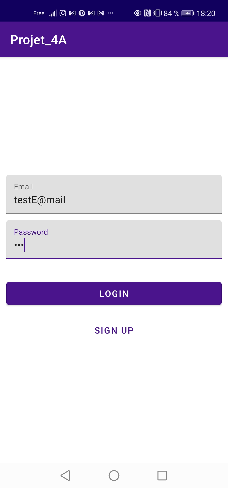
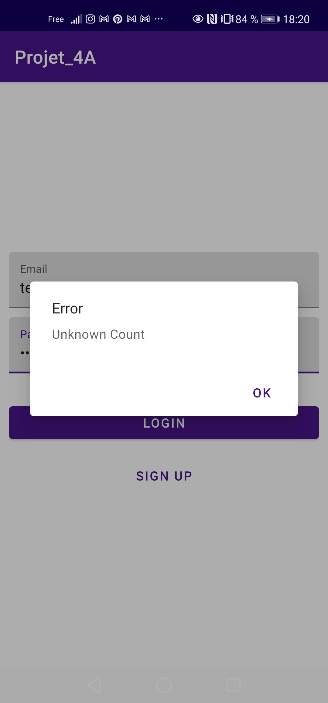
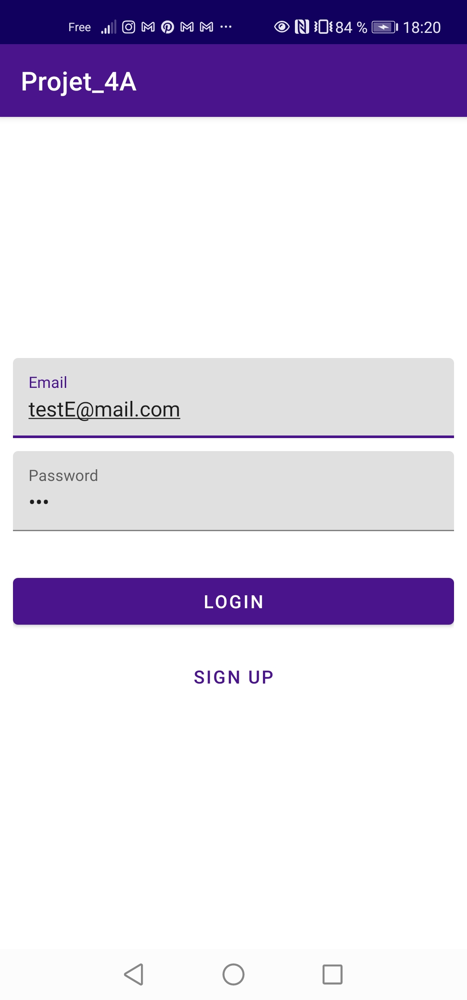

Liste de films avec possibilité de naviguer sur la liste:

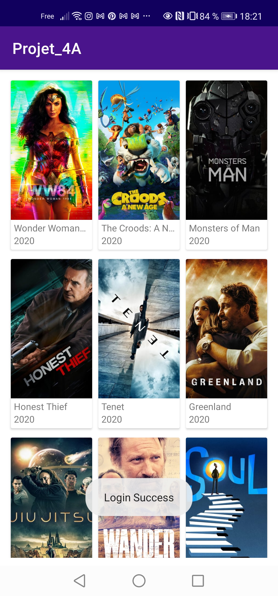

Détails d'un film en cliquant dessus :

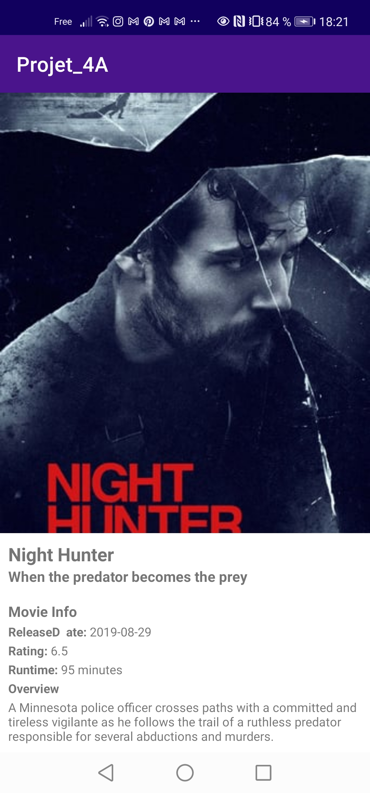
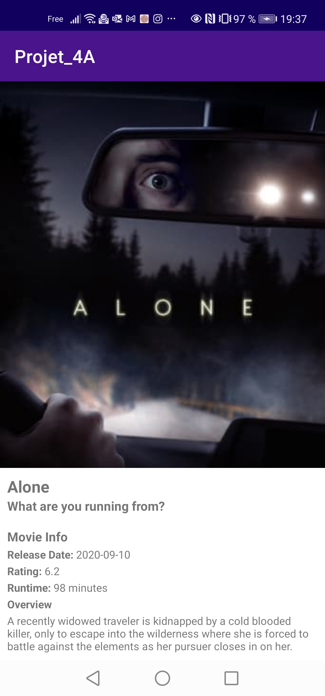
